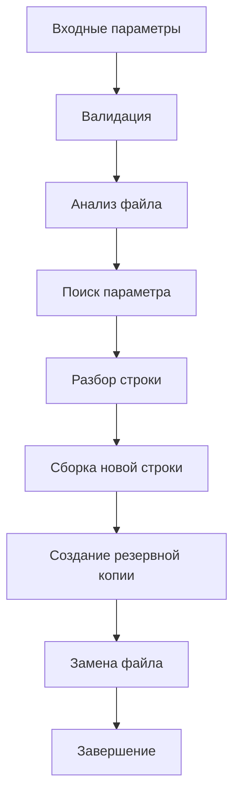

# Configuration File Quick Replace (cfrQuickReplace)


Утилита командной строки для безопасного и автоматизированного редактирования параметров в конфигурационных файлах. Написана на Bash с акцентом на надежность и безопасность.

## 🚀 Особенности

- 🔧 **Автоматическое редактирование** конфигурационных файлов
- 🔍 **Умный поиск** параметров с поддержкой различных форматов
- 💾 **Автоматическое резервное копирование** перед изменениями
- 🧪 **Режим симуляции** (`--dry-run`) для предварительного просмотра изменений
- 📝 **Сохранение комментариев** и форматирования исходного файла
- 🔄 **Отслеживание истории** изменений параметров
- 🛡️ **Безопасная обработка** специальных символов

## 📦 Установка

### Быстрая установка
```bash
curl -O https://raw.githubusercontent.com/yourusername/cfrQuickReplace/main/cfrQuickReplace.sh
chmod +x cfrQuickReplace.sh
sudo mv cfrQuickReplace.sh /usr/local/bin/cfrQuickReplace
```

### Установка из репозитория
```bash
git clone https://github.com/yourusername/cfrQuickReplace.git
cd cfrQuickReplace
sudo install -m 755 cfrQuickReplace.sh /usr/local/bin/cfrQuickReplace
```

## 🎯 Использование
### Базовый синтаксис
```bash
bash
cfrQuickReplace <ФАЙЛ_КОНФИГУРАЦИИ> <ПАРАМЕТР> <НОВОЕ_ЗНАЧЕНИЕ>
```
### Примеры использования
#### Изменение параметров PostgreSQL
```bash
# Изменить listen_addresses
cfrQuickReplace /etc/postgresql/14/main/postgresql.conf listen_addresses '*'

# Изменить порт
cfrQuickReplace /etc/postgresql/14/main/postgresql.conf port 5433
```

#### Работа с другими конфигурационными файлами
```bash
# SSH конфигурация
cfrQuickReplace /etc/ssh/sshd_config Port 2222

# Nginx конфигурация
cfrQuickReplace /etc/nginx/nginx.conf worker_processes 4
```

#### Безопасное тестирование
```bash
# Просмотреть что будет изменено (режим симуляции)
cfrQuickReplace --dry-run /etc/postgresql/14/main/postgresql.conf listen_addresses '*'

# Без создания резервной копии
cfrQuickReplace --no-backup /etc/ssh/sshd_config Port 2222
```
## 📋 Поддерживаемые форматы конфигурации
Утилита автоматически распознает и корректно обрабатывает различные стили конфигурационных файлов:

#### Комментированные параметры
```conf
#listen_addresses = 'localhost'
```
#### Параметры с кавычками

```conf
listen_addresses = 'localhost'
bind_address = "127.0.0.1"
```
#### Параметры без кавычек
```conf
port = 5432;
max_connections = 100;
```
#### Различное форматирование
```conf
listen_addresses='localhost';
listen_addresses = 'localhost';
listen_addresses = 'localhost';   # комментарий
```
## 🛠️ Опции командной строки

| Опция | Описание |
|-------|----------|
|--dry-run|Режим симуляции (показывает изменения без применения)|
|--no-backup|	Отключить создание резервной копии|
|-h, --help|	Показать справку по использованию|
|-v, --version|	Показать версию программы|

## 📊 Примеры работы
### Пример 1: Базовое использование
#### Исходный файл (postgresql.conf):

```conf
# CONNECTIONS AND AUTHENTICATION
listen_addresses = 'localhost'		# what IP address(es) to listen on;
port = 5432				# (change requires restart);
```

#### Команда:
```bash
cfrQuickReplace postgresql.conf listen_addresses '*'
```

#### Результат:
```conf
# CONNECTIONS AND AUTHENTICATION
listen_addresses = '*'		# what IP address(es) to listen on; # oldValue: localhost
port = 5432
```
#### Пример 2: Режим dry-run

```bash
cfrQuickReplace --dry-run postgresql.conf max_connections 200
```
##### Вывод:
```text
=== РЕЖИМ DRY-RUN ===
Найдена строка: max_connections = 100
Новая строка: max_connections = 200 # oldValue: 100

БЫЛО БЫ ВЫПОЛНЕНО:
- Создана резервная копия: postgresql.conf.backup
- Заменен исходный файл

Для применения изменений запустите без --dry-run
```

## 🗂️ Возвращаемые коды
| Код |	Описание|
|-----|---------|
|0|	Успешное выполнение|
|1|	Ошибка аргументов командной строки|
|2|	Файл не существует или недоступен|
|3|	Превышена максимальная длина параметра|
|4|	Превышена максимальная длина значения|
|5|	Внутренняя ошибка скрипта|
|6|	Параметр не найден в файле|

## 🔒 Безопасность
✅ Автоматическое резервное копирование (создается *.backup файл)

✅ Проверка существования файлов перед работой

✅ Валидация входных параметров

✅ Режим симуляции для безопасного тестирования

✅ Безопасная работа с временными файлами

✅ Обработка специальных символов в значениях

## ⚠️ Ограничения
- Максимальная длина имени параметра: 30 символов
- Максимальная длина значения: 60 символов
- Поддерживаются только текстовые конфигурационные файлы
- Требуется Bash версии 4.0 или выше
## 🧪 Тестирование
В репозитории представлены тестовые сценарии:

```bash
# Запуск тестов
./tests/run_tests.sh
```


### Тестирование конкретного случая

```bash
 ./tests/test_postgresql_conf.sh 
```

### Режим отладки
```bash 
-x cfrQuickReplace.sh test.conf parameter value
 ```

### 🏗️ Архитектура


## 🤝 Вклад в разработку
Мы приветствуем вклад в развитие проекта!

1. Форкните репозиторий
2. Создайте ветку для фичи (git checkout -b feature/amazing-feature)
3. Закоммитьте изменения (git commit -m 'Add amazing feature')
4. Запушьте в ветку (git push origin feature/amazing-feature)
5. Откройте Pull Request